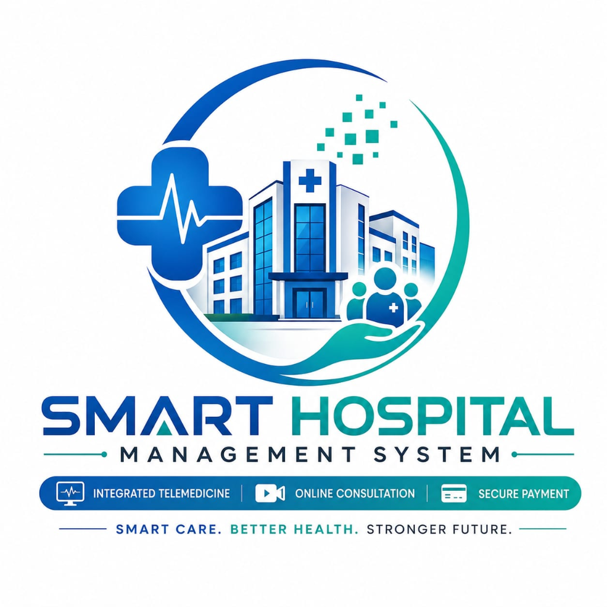

# 🏥 Niramaya — Smart Hospital ERP & Telemedicine Platform

<div align="center">

  

  ### **Next-Generation Connected Healthcare Ecosystem & Hospital Management System**
  *Empowering Patients, Doctors, Nurses, Pharmacists, Lab Technicians, & Administrators in Real Time.*

  <p align="center">
    <a href="https://github.com/srivatsan2007/Niramaya_Hospital_Management_System"></a>
    <a href="https://github.com/srivatsan2007/Niramaya_Hospital_Management_System"></a>
    <a href="https://github.com/srivatsan2007/Niramaya_Hospital_Management_System"></a>
    <a href="https://github.com/srivatsan2007/Niramaya_Hospital_Management_System"></a>
    <a href="https://github.com/srivatsan2007/Niramaya_Hospital_Management_System"></a>
    <a href="https://github.com/srivatsan2007/Niramaya_Hospital_Management_System"></a>
  </p>

</div>

---

## 🌟 Executive Overview

**Niramaya Hospital Management System (HMS)** is an enterprise-grade, high-performance healthcare operations platform built with a high-throughput **Native Java HTTP Backend** (zero external framework bloat) and a **Modern, Glassmorphism-Styled Frontend Design System**.

It connects every hospital department into a unified data stream with cloud database persistence (**Neon PostgreSQL**) and embedded local fallback (**SQLite**).

```
 ┌────────────────────────────────────────────────────────────────────────┐
 │                      NIRAMAYA UNIFIED HEALTHCARE ERP                   │
 ├──────────────┬──────────────┬──────────────┬─────────────┬─────────────┤
 │   PATIENT    │    DOCTOR    │    NURSE     │  PHARMACY   │     LAB     │
 │    PORTAL    │   CLINICAL   │     WARD     │   & STOCK   │ DIAGNOSTICS │
 ├──────────────┴──────────────┴──────────────┴─────────────┴─────────────┤
 │                ADMIN MASTER CONSOLE & LIVE COUNTER BILLING             │
 ├────────────────────────────────────────────────────────────────────────┤
 │   CORE JAVA BACKEND (REST APIs)  ⇄  NEON POSTGRESQL / SQLITE ENGINE    │
 └────────────────────────────────────────────────────────────────────────┘
```

---

## ✨ Key Platform Features

### 1. 👥 7-Role Specialized Workspaces
* **🩺 Doctor Clinical Suite**: Digital queue management, live patient history, ICD-10 diagnostic logs, electronic prescription (e-Rx) generator with QR verification, and automated Google Meet / Telemedicine video consultation links.
* **👩‍⚕️ Nurse Ward & Vitals Hub**: Bed/ward allocation, real-time vital signs charting (BP, Pulse, SpO2, Temp), Medication Administration Record (MAR), shift handover notes, and 1-click **Emergency SOS Broadcast**.
* **💊 Central Pharmacy Console**: Interactive medicine inventory catalog, stock replenishment tracking, expiry alerts, digital prescription dispensing, and POS tax invoice generator.
* **🧪 Laboratory & Pathology Suite**: Diagnostic test queue, sample collection records, quantitative test parameter entry, and automated PDF lab report generation with NABL doctor signatures.
* **👤 Patient Self-Service Portal**: Doctor discovery by specialty, live token generation, digital prescription storage, download history, and instant tax invoice printing.
* **🎟️ Admin Live Counter Billing & Token Approval**: Real-time counter payment collection for offline patients with instant receipt unlocking.
* **📹 Telemedicine Room**: Built-in video calling layout with camera/mic controls, in-call clinical notes, screen sharing, and automatic consultation timer.

---

### 2. 🎟️ Counter Payment & Admin Verification Flow
Designed specifically for modern hospital reception workflows:
1. Patient books an appointment and selects **"Pay at Counter / Offline Payment"**.
2. An unpaid ticket is created in the database and the patient's official tax invoice receipt is **locked** (`🔒 Receipt Locked - Pay at Desk`).
3. An urgent payment ticket appears in the **Admin Console** with Patient ID, Doctor Name, and Consultation Fee.
4. Once reception collects cash or UPI and clicks **"Collect & Mark Paid"**, the database state updates immediately.
5. Patient portal auto-polls and unlocks the **`📄 Print Official Tax Invoice & Receipt`** in real time!

---

### 3. 📱 100% Responsive on All Screen Sizes
Engineered with custom CSS tokens and media query breakpoints:
* **📱 Mobile Phones (320px – 768px)**: Smooth sliding sidebar drawers with backdrop blur, touch-friendly 44px buttons, 1-column responsive card grids, and swipeable tables.
* **📟 Tablets & iPads (768px – 992px)**: Adaptive 2-column KPI stats, collapsible navigation, and modal viewports.
* **💻 Laptops & Desktops (>993px)**: Full executive dashboard layout with multi-column analytics, charts, and activity trails.

---

## 🔑 Demo Access Credentials

You can test all user roles immediately with preloaded demo accounts:

| Role | Portal URL | Demo Email | Demo Password |
| :--- | :--- | :--- | :--- |
| **👤 Patient** | `/dashboard.html` | `patient@niramaya.health` | `demo1234` |
| **👑 Admin** | `/admin-dashboard.html` | `admin@niramaya.health` | `demo1234` |
| **🩺 Doctor** | `/doctor-dashboard.html` | `doctor@niramaya.health` | `demo1234` |
| **👩‍⚕️ Nurse** | `/nurse-dashboard.html` | `nurse@niramaya.health` | `demo1234` |
| **💊 Pharmacist** | `/pharmacy-dashboard.html` | `pharmacist@niramaya.health` | `demo1234` |
| **🧪 Lab Tech** | `/lab-dashboard.html` | `lab@niramaya.health` | `demo1234` |
| **📹 Telemedicine** | `/telemedicine.html` | `doctor@niramaya.health` | `demo1234` |

---

## 🏗️ Architecture & Directory Structure

```
hospital-java-app/
├── src/main/java/com/hospital/
│   ├── Server.java                   # Core HTTP server & REST endpoint routes
│   ├── dao/
│   │   ├── DBConnection.java         # Dual Neon PostgreSQL & SQLite JDBC manager
│   │   ├── AppointmentDAO.java       # Booking, counter billing & token approvals
│   │   ├── DoctorDAO.java            # Specialist schedules & availability
│   │   ├── NurseDAO.java             # Vitals, shift handovers & ward allocations
│   │   ├── PharmacyDAO.java          # Medicine catalog, stock alerts & orders
│   │   ├── LabDAO.java               # Diagnostics, test entries & reports
│   │   └── OnlineConsultationDAO.java# Telemedicine rooms & session history
│   └── model/                        # Java POJOs (Appointment, Prescription, etc.)
├── public/
│   ├── index.html                    # Modern landing page with mobile nav drawer
│   ├── login.html                    # Unified role-based authentication portal
│   ├── dashboard.html                # Patient portal with live booking & receipts
│   ├── admin-dashboard.html          # Executive ERP dashboard & counter payments
│   ├── doctor-dashboard.html         # Clinical workspace & prescription pad
│   ├── nurse-dashboard.html          # ICU/Ward monitoring & vitals tracker
│   ├── pharmacy-dashboard.html       # Medicine catalog & POS billing
│   ├── lab-dashboard.html            # Diagnostics queue & test report builder
│   ├── telemedicine.html             # Video consultation room
│   ├── css/
│   │   └── style.css                 # Comprehensive multi-device design system
│   └── assets/
│       ├── js/mobile-responsive.js   # Universal sliding drawer & touch controller
│       └── logo.png                  # Niramaya brand asset
├── Dockerfile                        # Multi-stage Eclipse Temurin JDK 21 build
├── render.yaml                       # Blueprint configuration for Render Cloud
├── build.sh & start.sh               # Linux cloud deployment entry scripts
└── README.md                         # Project documentation
```

---

## ⚡ Quick Start Guide

### Prerequisites
* **Java Development Kit (JDK 21 or newer)**
* **Git**

Verify Java installation:
```bash
javac -version
java -version
```

### 1. Clone the Repository
```bash
git clone https://github.com/srivatsan2007/Niramaya_Hospital_Management_System.git
cd Niramaya_Hospital_Management_System
```

### 2. Compile Java Source Code
```bash
# Windows (PowerShell)
javac -cp "lib/*;out" -d out "@sources.txt"

# Linux / macOS
javac -cp "lib/*:out" -d out $(find src/main/java -name "*.java")
```

### 3. Launch Hospital Server
```bash
# Windows
java -cp "out;lib/*" com.hospital.Server

# Linux / macOS
java -cp "out:lib/*" com.hospital.Server
```

Open your browser and visit: **`http://localhost:8080/`**

---

## ☁️ Cloud Deployment (Render / Docker)

This repository includes first-class support for **Render Cloud** and **Docker**:

### Deploying to Render via Blueprint:
1. Connect your GitHub repository to [Render.com](https://render.com).
2. Create a new **Blueprint** service selecting `render.yaml`.
3. Set your PostgreSQL environment variables in Render Dashboard:
   - `POSTGRES_URL`: `jdbc:postgresql://<neon-host>:5432/<dbname>?sslmode=require`
   - `POSTGRES_USER`: `<username>`
   - `POSTGRES_PASS`: `<password>`
4. Deploy! Render automatically runs the multi-stage `Dockerfile` and publishes your public HTTPS URL.

### Running with Docker Locally:
```bash
# Build Docker image
docker build -t niramaya-hospital .

# Run container on port 8080
docker run -p 8080:8080 niramaya-hospital
```

---

## 🛡️ Database & Security Features
* **Dual Database Resilience**: Uses cloud Neon PostgreSQL with automatic embedded SQLite failover if internet connectivity is interrupted.
* **SQL Injection Protection**: 100% prepared statements (`PreparedStatement`) across all Data Access Objects.
* **Path-Traversal Prevention**: `StaticFileHandler` validates file resolution within the `public/` directory root.
* **CORS & Multi-Origin Headers**: Pre-configured for cloud web apps and cross-device testing.

---

## 📄 License & Attribution

Developed with ❤️ for **Niramaya Hospitals**.  
Distributed under the **MIT License**. Feel free to use, modify, and distribute for healthcare management applications.

<div align="center">
  <b>Niramaya — Compassion. Care. Cure.</b><br>
  <sub>© 2026 Niramaya Smart Healthcare Platform. All rights reserved.</sub>
</div>
